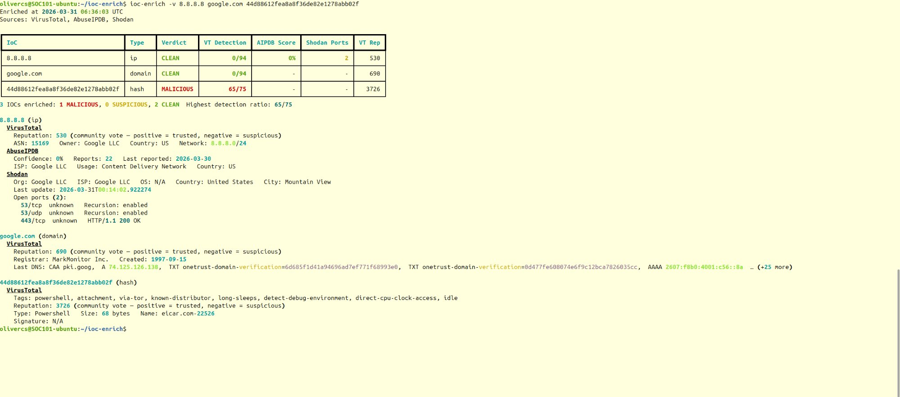
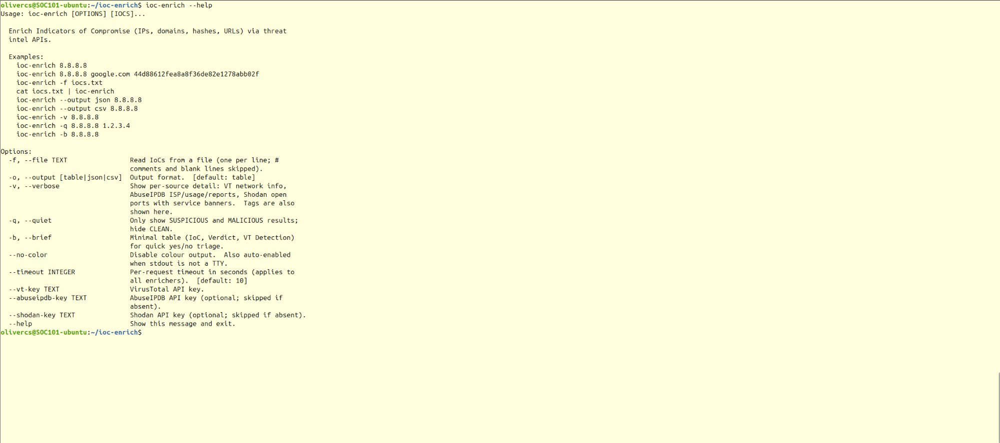

# ioc-enrich

A command-line tool for enriching Indicators of Compromise (IPs, domains, hashes, URLs) via threat intelligence APIs. Built for SOC analysts and cybersecurity students who need fast, scriptable IOC triage without leaving the terminal.

 

---

## Why ioc-enrich?

Web-based threat intel portals are useful but slow for batch triage. `ioc-enrich` lets you pipe IOCs directly from alerts, SIEM exports, or investigation notes into VirusTotal, AbuseIPDB, and Shodan — all in one command — and get a colour-coded verdict table in seconds. Everything stays on your machine; no browser required.

---

## Screenshots

### Default Output

Full verdict table across all three sources — VirusTotal detection ratio, AbuseIPDB abuse score, and Shodan open port count — for a mixed batch of IPs, domains, and hashes.


### Verbose Mode

Per-source detail blocks (`-v`) showing VT network metadata, AbuseIPDB ISP/usage/reports, and Shodan open ports with service banners.



### Brief Mode

Minimal three-column triage view (`-b`) — IoC, Verdict, and VT Detection ratio only — for rapid yes/no decisions.


### Quiet Mode

Quiet mode (`-q`) filtering out CLEAN results, leaving only SUSPICIOUS and MALICIOUS IOCs for focused review.


### Help

Full CLI help text showing all flags and usage examples.



---

## Features

- **Multi-source enrichment** — VirusTotal (all IOC types), AbuseIPDB (IPs), and Shodan (IPs) in a single command
- **Automatic IOC classification** — detects IPv4, domain, MD5/SHA1/SHA256 hash, and URL without manual flags
- **Colour-coded verdict table** — MALICIOUS / SUSPICIOUS / CLEAN with X/Y detection ratios at a glance
- **Deduplication** — duplicate IOCs are queried once and flagged in output
- **File and stdin input** — read IOCs from a file (`-f iocs.txt`) or pipe them in; `#` comments and blank lines skipped
- **Verbose mode** (`-v`) — per-source deep dive: ASN/network (VT), ISP/usage/reports (AbuseIPDB), open ports with service banners (Shodan)
- **Brief mode** (`-b`) — minimal three-column table for quick yes/no triage
- **Quiet mode** (`-q`) — hides CLEAN results; shows only threats
- **JSON and CSV export** — machine-readable output for downstream scripts or SIEM ingestion
- **Graceful degradation** — AbuseIPDB and Shodan are optional; absent keys are skipped silently with clear N/K indicators
- **No-colour mode** — `--no-color` flag or automatic TTY detection for piped output

---

## Installation

### Prerequisites

- Python 3.11+
- pip

### Setup

```bash
# Clone the repository
git clone https://github.com/oliversweeney-cs/ioc-enrich.git
cd ioc-enrich

# Create and activate a virtual environment
python3 -m venv .venv
source .venv/bin/activate

# Install the package and dependencies
pip install -e ".[dev]"

# Configure API keys
cp .env.example .env
# Edit .env and fill in your keys (see Configuration below)
```

---

## Configuration

API keys are loaded from a `.env` file in the project root (or from environment variables directly).

```bash
# .env
VIRUSTOTAL_API_KEY=your_vt_api_key_here       # Required
ABUSEIPDB_API_KEY=your_abuseipdb_api_key_here # Optional — IP enrichment only
SHODAN_API_KEY=your_shodan_api_key_here        # Optional — IP enrichment only
```

| Variable | Required | Purpose |
|---|---|---|
| `VIRUSTOTAL_API_KEY` | Yes | VirusTotal API v3 — all IOC types |
| `ABUSEIPDB_API_KEY` | No | AbuseIPDB v2 — abuse confidence score for IPs |
| `SHODAN_API_KEY` | No | Shodan REST API — open ports and services for IPs |

Keys can also be passed directly via `--vt-key`, `--abuseipdb-key`, and `--shodan-key` flags.

---

## Supported IOC Types

| Type | Examples | Sources |
|---|---|---|
| IPv4 address | `8.8.8.8`, `192.168.1.1` | VirusTotal, AbuseIPDB, Shodan |
| Domain | `example.com`, `malicious.ru` | VirusTotal |
| MD5 / SHA1 / SHA256 hash | `44d88612...`, `3395856c...` | VirusTotal |
| URL | `https://phish.example.com/login` | VirusTotal |

---

## API Sources

| Source | IOC Types | What it provides | Free tier |
|---|---|---|---|
| **VirusTotal** | IP, domain, hash, URL | Detection ratio across 70+ AV engines, reputation score, tags, network metadata | 4 req/min, 500/day |
| **AbuseIPDB** | IP only | Abuse confidence score (0–100%), total community reports, ISP, usage type, country | 1,000 checks/day |
| **Shodan** | IP only | Open ports, running services with banners, OS, org, geolocation | Varies by plan |

---

## Verdict Thresholds

Verdicts are based on VirusTotal malicious vendor count:

| Verdict | Condition |
|---|---|
| **MALICIOUS** | 5 or more vendors flag the IOC as malicious |
| **SUSPICIOUS** | 1–4 vendors flag the IOC as malicious |
| **CLEAN** | 0 malicious detections |
| **ERROR** | VT API returned an error for this IOC |

---

## Usage

### Single IOC

```bash
ioc-enrich 8.8.8.8
```

### Multiple IOCs (mixed types)

```bash
ioc-enrich 8.8.8.8 google.com 44d88612fea8a8f36de82e1278abb02f
```

### File input

```bash
# iocs.txt supports # comments and blank lines
ioc-enrich -f iocs.txt
```

### Piped input

```bash
cat iocs.txt | ioc-enrich
echo "8.8.8.8" | ioc-enrich
```

### Verbose mode — per-source detail

```bash
ioc-enrich -v 8.8.8.8
```

Verbose output includes:
- **VirusTotal** — reputation score, tags, ASN/network (IP), registrar/DNS (domain), file type/signature (hash)
- **AbuseIPDB** — confidence %, report count, last reported date, ISP, usage type, country
- **Shodan** — org, OS, port list with product/version/banner for each service

### Quiet mode — threats only

```bash
ioc-enrich -q 8.8.8.8 1.2.3.4 example.com
```

Hides CLEAN results; shows only SUSPICIOUS and MALICIOUS IOCs.

### Brief mode — quick triage

```bash
ioc-enrich -b 8.8.8.8 1.2.3.4
```

Minimal three-column table (IoC, Verdict, VT Detection) for rapid yes/no decisions.

### JSON export

```bash
ioc-enrich --output json 8.8.8.8 > report.json
```

### CSV export

```bash
ioc-enrich --output csv -f iocs.txt > report.csv
```

### No-colour output (for piping or logging)

```bash
ioc-enrich --no-color 8.8.8.8
# Also activates automatically when stdout is not a TTY
```

### All options

```
Options:
  -f, --file PATH              Read IOCs from a file (one per line)
  -o, --output [table|json|csv]  Output format  [default: table]
  -v, --verbose                Show per-source detail blocks
  -q, --quiet                  Only show SUSPICIOUS and MALICIOUS results
  -b, --brief                  Minimal 3-column table for quick triage
  --no-color                   Disable colour output
  --timeout INTEGER            Per-request timeout in seconds  [default: 10]
  --vt-key TEXT                VirusTotal API key
  --abuseipdb-key TEXT         AbuseIPDB API key
  --shodan-key TEXT            Shodan API key
  --help                       Show this message and exit.
```

---

## Running Tests

```bash
# All tests
pytest

# Single file
pytest tests/test_models.py

# Single test by name
pytest -k test_enrich_ip

# With verbose output
pytest -v
```

The test suite uses the `responses` library to mock all HTTP calls — no real API keys needed to run tests.

---

## Project Structure

```
ioc-enrich/
├── ioc_enrich/
│   ├── cli.py              # Click entrypoint — collection, dedup, rendering
│   ├── models.py           # IoCType, detect_ioc_type(), result dataclasses, IoCBundle
│   └── enrichers/
│       ├── virustotal.py   # VirusTotal API v3 enricher
│       ├── abuseipdb.py    # AbuseIPDB v2 enricher (IP only)
│       └── shodan.py       # Shodan REST API enricher (IP only)
├── tests/                  # pytest test suite (40 tests, all HTTP mocked)
├── .env.example            # API key template
├── pyproject.toml          # Package metadata and dependencies
└── CLAUDE.md               # AI assistant instructions for this repo
```

---

## License

MIT License — see [LICENSE](LICENSE) for details.
